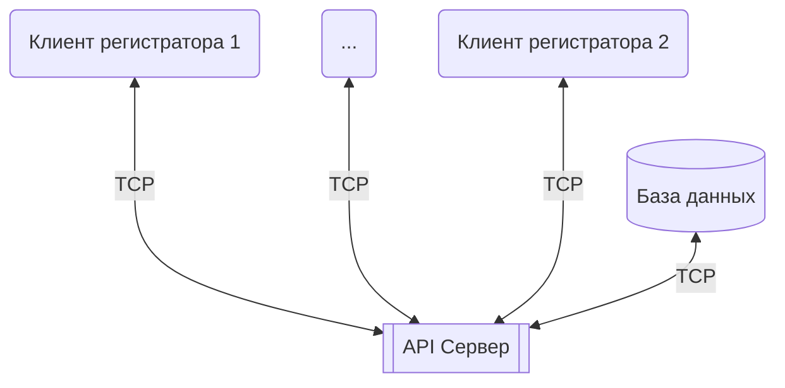
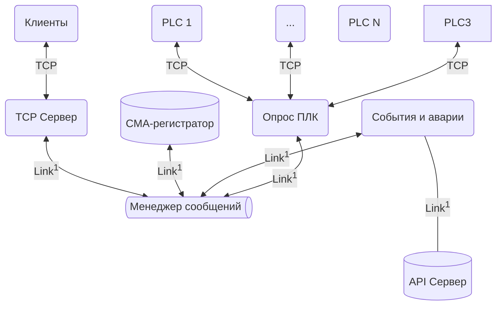
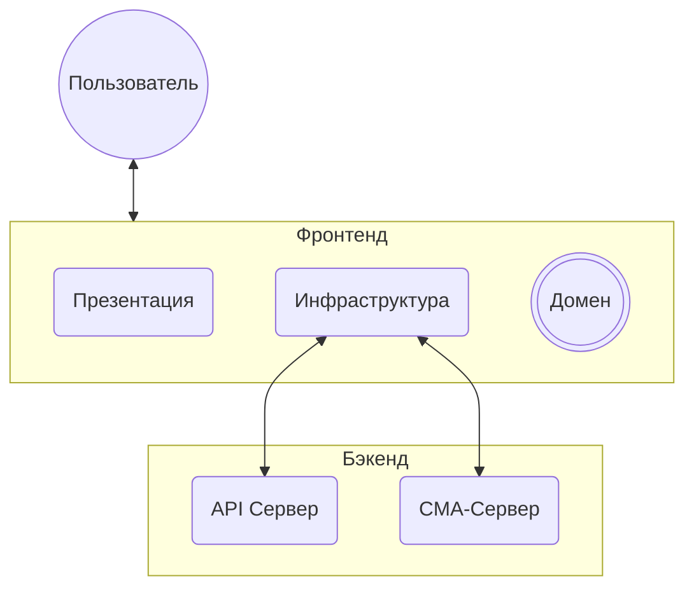

# Архитектура - Описание элементов

## API-Сервер

- Хранение данных 
- Структурированный доступ
- Защита данных

Схема 1. Структурная схема модуля API-Сервер

## CMA-Сервер

- Периодический опрос ПЛК с фиксированной частотой
- Отслеживание событий и аварий
- Сохранение истории событий и аварий в БД

    `Link` - Механизм асинхронного взимодествия между модулями и потоками приложения посредствам передачи сообщений.
Схема 2. Структурная схема модуля CMA-Сервер

## CMA-Регистратор
- Сбор нужных данных с CMA-Server'a и из БД
- Подсчет параметров в реальном времени
- Сохранение результатов вычислений в БД

## Клиент регистратора

- Домен - сущности системы
- Инфраструктура - внешние взаимодествия
- Презентация - визуализация информации, взаимодействие с пользователем

Схема 3. Структурная схема клиентского модуля
