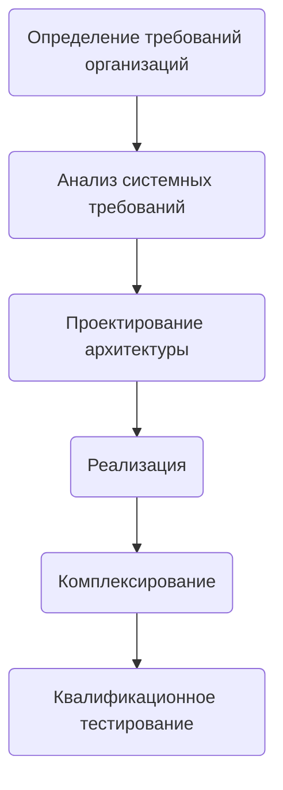

# Разработка и модернизация продукта

При разработке и модернизации продукта используются следующие процессы

```mermaid
flowchart TD
id1("Определение требований организаций") --> id2("Анализ системных требований")
id2 --> id3("Проектирование архитектуры")
id3 --> id4("Реализация")
id4 --> id5("Комплексирование")
id5 --> id6("Квалификационное тестирование")
```

