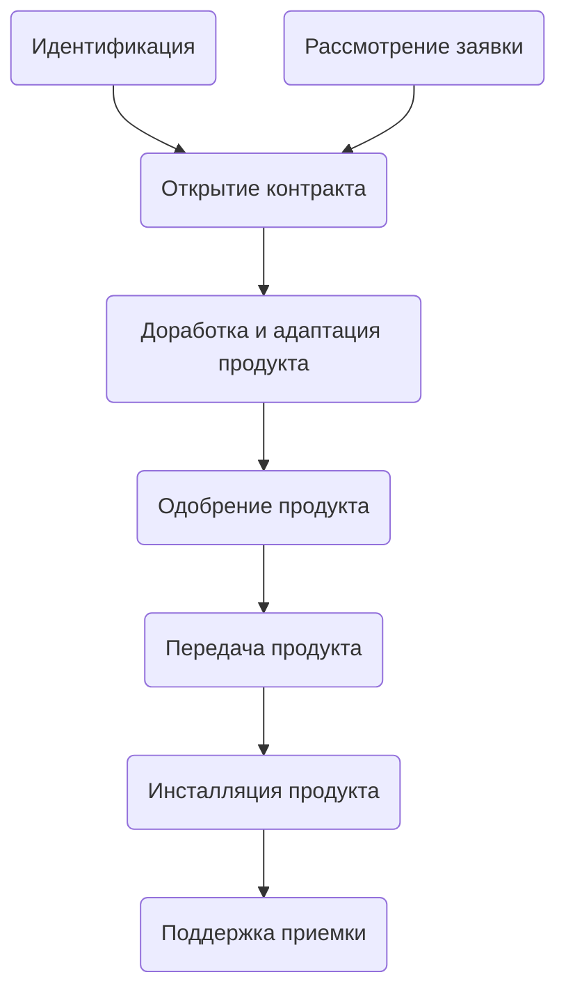

# Поставка

## Общие положения

Цель процесса поставки заключается в передаче приобретающей стороне продукта,
удовлетворяющего согласованным требованиям, адаптированного для работы на грузоподъемном механизме.

В результате процесса поставки:

- определяется приобретающая сторона для продукта или услуги;
- дается ответ на заявку приобретающей стороны;
- заключается соглашение с приобретающей стороной;
- продукт дорабатывается и адаптируется для работы с грузоподъемным механизмом;
- продукт поставляются приобретающей стороне;
- продукт инсталлируется на рабочих местах эксплуатирующей организации.

Процесс поставки состоит из следующих видов деятельности.

## Идентификация

Вид деятельности состоит из следующих задач:

- идентификация организаций;
- идентификация грузоподъемного механизма.

### Идентификация организаций

- [ ] Определяется существование и идентифицируются участники процесса поставки и эксплуатации продукта:

  - приобретающая сторона, которая представляет организацию, имеющую потребность в продукте или услуге (консалтинговая компания, поставщик систем управления, машиностроительный завод);
  - организация, которая будет осуществлять эксплуатацию продукта (владелец грузоподъемного механизма);
  - прочие участники процесса поставки и эксплуатации продукта (поставщик систем управления, машиностроительный завод).

### Идентификация грузоподъемного механизма

- [ ] Определяется тип грузоподъемного механизма, количество грузоподъемных механизмов, для которых требуется осуществить поставку, их серийность.

## Рассмотрение заявки

Вид деятельности состоит из следующих задач:

- рассмотрение требований;
- принятие решения;
- подготовка ответа.

### Рассмотрение требований

- [ ] Формируется перечень функциональных требований к экземпляру продукта;
- [ ] Определяются возможность доработки продукта для выполнения требований;
- [ ] Определяются сроки выполнения контракта.

### Принятие решения

- [ ] Принимается решение о принятии или отклонения заявки.

### Подготовка ответа

- [ ] Подготавливается ответ на заявку приобретающей стороны с принятым решением и условиями поставки.

## Открытие контракта

Вид деятельности состоит из следующих задач:

- согласовывается контракт;
- оформление бухгалтерских документов.

### Согласование контракта

- [ ] Проводятся переговоры, согласовываются изменения и заключается контракт с приобретающей стороной.

### Оформление бухгалтерских документов

- [ ] Оформляется оборот бухгалтерских документов в соответствии с общими принятыми требованиями по поставки товара;
- [ ] Согласовываются и подписываются бухгалтерские документы;

## Адаптация и модернизация продукта

Вид деятельности состоит из следующих задач:

- модернизация (при предъявлении новых функциональных требований к продукту);
- разработка исходных данных для адаптации и тестовых примеров;
- адаптация;
- тестирование;

### Разработка исходных данных для адаптации и тестовых примеров

- [ ] принимается от приобретающей стороны необходимая документация на грузоподъемный механизм;
- [ ] проводится анализ ее достаточности для возможности доработки и адаптации продукта для работы на конкретном грузоподъемном механизме;
- [ ] разрабатываются исходные данные с технической информации по грузоподъемному механизму;
- [ ] при необходимости запрашивается и принимается дополнительная документация и информация;
- [ ] разрабатываются тестовые примеры.

### Адаптация продукта

- [ ] реализовываются исходные данные по грузоподъемному механизму в Продукте;
- [ ] адаптируется эксплуатационная документация на Продукт.

### Тестирование

- [ ] проводится тестирование продукта;
- [ ] оформляется отчет с тестовыми примерами.

## Одобрение продукта

Вид деятельности состоит из следующих задач:

- открытие заявки на одобрение;
- получение одобрение;
- закрытие заявки.

## Передача продукта

Вид деятельности состоит из следующих задач:

- упаковка продукта;
- оформление бухгалтерских документов;
- отправка продукта.

### Упаковка продукта

- [ ] подготавливается и тестируется инсталлятор;
- [ ] формируется и изготавливается документация и упаковка.

### Оформление бухгалтерских документов

- [ ] Оформляется оборот бухгалтерских документов в соответствии с общими принятыми требованиями по поставки товара;
- [ ] Согласовываются и подписываются бухгалтерские документы.

### Отправка продукта

- [ ] Продукт отправляется способом, определенным контрактом.

## Инсталяция программы и поддержка приемки

Вид деятельности состоит из следующих задач:

- [ ] продукт инсталируется на местах эксплуатации в соответствии с требованиями контракта;
- [ ] поддерживаются приемочные тесты и ревизии, проводимые приобретающей стороной.
