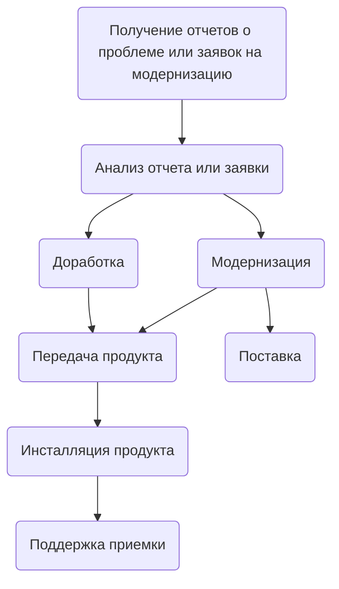

# Сопровождение ПО

Цель процесса сопровождения  является  обеспечение эффективной по затратам поддержки поставляемого продукта.

В результате успешного осуществления процесса сопровождения программных средств:

- разрабатывается стратегия сопровождения для управления модификацией и перемещением программных продуктов согласно стратегии выпусков;
- выявляются воздействия изменений в существующей системе на организацию, операции или интерфейсы;
- по мере необходимости обновляется связанная с изменениями системная и программная документация;
- разрабатываются модифицированные продукты с соответствующими тестами, демонстрирующими, что требования не ставятся под угрозу;
- обновленные продукты помещаются в среду заказчика;
- сведения о модификации системных программных средств доводятся до всех затронутых обновлениями сторон

> [!NOTE]
> Поставка, инсталляция, передача и модернизация осуществляется в соответствии с соответствующими разделами!

## Получение отчетов о проблеме или заявок на модернизацию

Вид деятельности состоит из следующих задач:

- [ ] принимается отчет о проблеме или заявка на модернизацию, регистрируется и доводится до ответственных лиц.

## Анализ отчета или заявки

Вид деятельности состоит из следующих задач:

- [ ] проводится оценка критичности проблемы или оценка актуальность вопроса модификации;
- [ ] проводится копирование или верификация проблемы;
- [ ] анализируются и документируются возможные варианты решения проблемы или выполнения модификации;
- [ ] результаты анализа и варианты решения проблемы или выполнения модификации доводятся до заказчика;
- [ ] согласование и получения одобрения заказчика выбранного варианта решения проблемы или выполнения модификации;

## Доработка

Вид деятельности состоит из следующих задач:

- [ ] устранение ошибок продукта и документации;
- [ ] тестирование продукта;

<!--TODO
Перечислить персонал участвующий в разработке
- Главный конструктор
- Технический менеджер продукту
- Руководитель группы разработки
- Программисты разработчики
-->

<!--TODO
Задачам назначить ответственных и инструменты с помощью которых решается задача
| Задача | Ответственный | Инструмент |
| ------ | ------------- | ---------- |
|        |               |            |
-->
